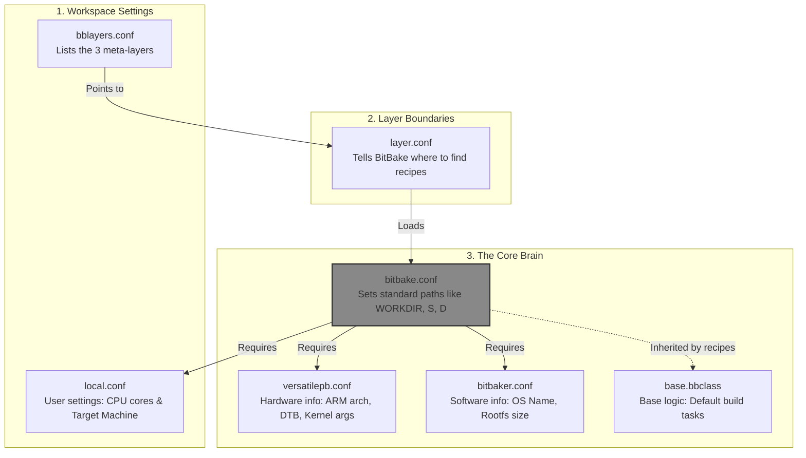
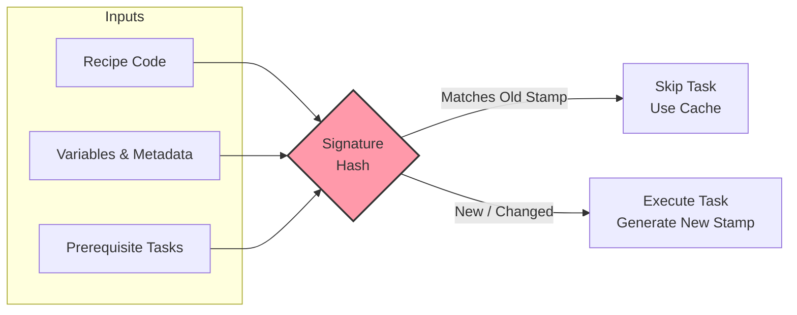
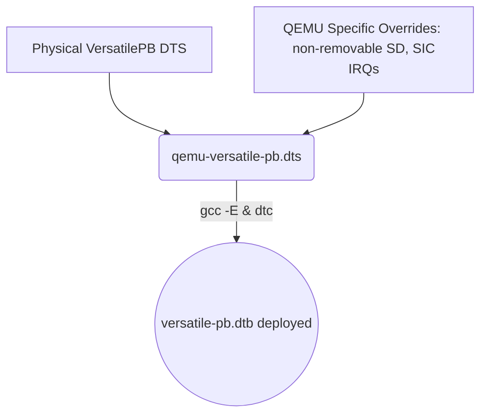
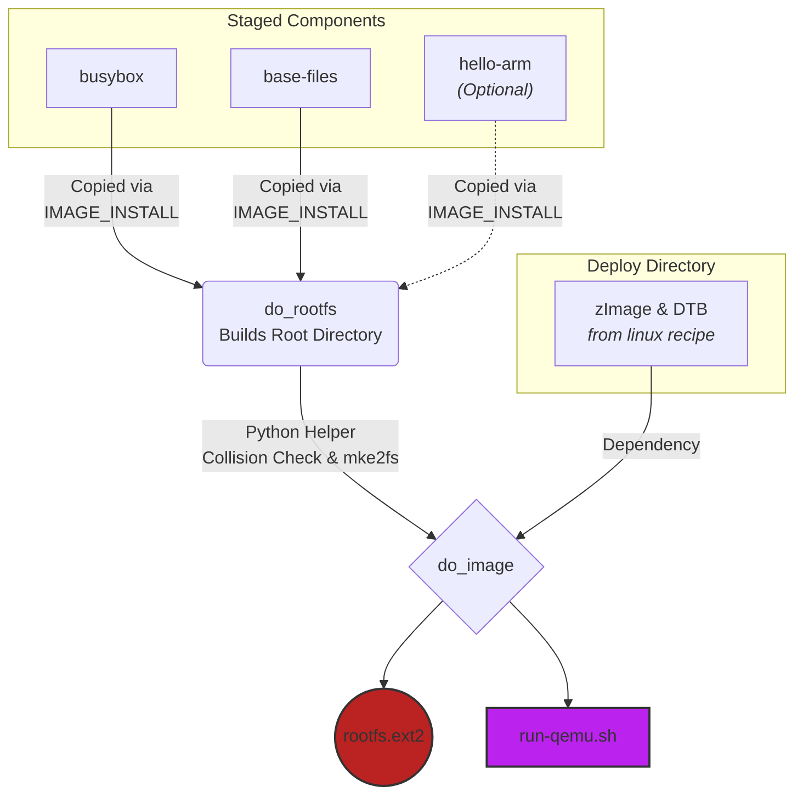
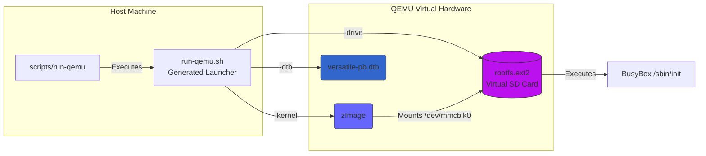

# Standalone BitBake: from the first task to an ARM Linux console

## Chapter 1 — One project from an empty directory

We will build our own small Linux system with BitBake as the task engine.
BitBake reads configuration, recipes and classes; those files tell it what to
do. We supply that policy ourselves. No Yocto or OpenEmbedded metadata is
used, and you do not need another tutorial or an existing distro checkout.

The destination is QEMU's ARM VersatilePB board: Linux 7.2.6, static BusyBox
1.38.0, init and a writable ext2 SD root. QEMU loads the kernel directly.
There is no bootloader, initramfs, package manager, configured network service,
or production security policy. We use a prebuilt host cross-toolchain rather
than building a compiler.

This repository contains the **finished reference files**. Each chapter asks
you to inspect exact linked files, explains the relevant part, then builds or
checks one increment. Do not expect a separate source tree for every chapter.
Commands below run in this repository's root unless marked **guest**.
Results labeled “Expected” describe what should happen in your run. Chapter
16 teaches you to validate your own result; [VALIDATION.md](VALIDATION.md)
separately records observed builds and tests.

**Inspect:** [README.md](README.md), [.gitignore](.gitignore) and
[LICENSE](LICENSE).

The MIT license covers original tutorial content, metadata and scripts,
copyright 2026 BitBaker contributors. Fetched BitBake, Linux, BusyBox,
toolchains and other upstream sources retain their own licenses. A recipe's
`LICENSE` variable is descriptive metadata, not an implemented compliance
check or a replacement for upstream licensing obligations.

If you already have this project, enter it from its containing directory:

```sh
cd bitbaker--distro
pwd
```

Expected: `pwd` ends in `bitbaker--distro`. A different installation path is
fine, but use a path without spaces.

To reconstruct the project instead, start with an empty directory at a
location of your choice:

```sh
mkdir bitbaker--distro
cd bitbaker--distro
mkdir -p scripts build/conf
```

Initialize an independent repository, rather than tracking these files in
any parent checkout:

```sh
git init -b main
```

This command requires Git. If it is not installed yet, defer just this command
until Chapter 2 has provisioned the host; directory creation above needs no
Git. Initialization creates neither a commit nor a remote.

For this alternative, keep the supplied reference project open separately:
links refer to files there, not files already present in your empty directory.
Type the inline examples below for the small configuration and task files;
for larger files, copy the complete linked reference content as introduced.
Create parent directories first with `mkdir -p`. Copy [.gitignore](.gitignore)
and [LICENSE](LICENSE) from that reference now. This is reconstruction from
source metadata, not writing Linux or BitBake themselves from scratch. Chapter 2
introduces the host checker; Chapter 3 introduces bootstrap, the wrapper and
all configuration. Later chapters introduce the remaining classes and recipes.
You are reconstructing the same final project, not switching between chapter
snapshots. The one deliberate intermediate file is Chapter 5's fetch-only
Linux recipe; Chapter 9 replaces it with the complete kernel recipe.

The full configuration introduced early lists **all three layers** and loads
machine/distro files immediately. Create their configuration files in Chapter 3
even though their recipes and policy are explained later. Otherwise parsing
will fail before you can build `hello`.

This work requires no parent repository. Nothing in the instructions
automatically creates a project Git commit or remote.

### Plan time and disk space

The earlier clean reconstruction used about **2.3 GB** for source downloads,
the engine and build output. Allow at least **5 GB free** for a single tree
and extra space for independent validation builds and image backups. On the
tested four-core host with `-j 4`, Linux compilation took about **14 minutes**
and BusyBox fetch/build about **3 minutes**. Budget roughly **25 minutes of
machine time**, excluding package installation and reading/typing the lessons;
a first learning session will take substantially longer.

These are observations, not minimum hardware guarantees. Downloads, slow
storage and fewer CPUs can increase the time. Check `df -h .` for free disk
space. Leave kernel builds running while they compile; task output is captured
in logs even when the terminal is quiet.

## Chapter 2 — Prepare the Linux host

The build runs as your normal user. Only installation of host packages and
locale provisioning require `sudo`. Never run BitBake or image creation with
`sudo`.

On a Debian/Ubuntu-style host, install:

```sh
sudo apt-get update
sudo apt-get install build-essential git wget python3 locales file \
    xz-utils bzip2 patch bc bison flex libssl-dev libelf-dev libncurses-dev \
    gcc-arm-linux-gnueabi libc6-dev-armel-cross qemu-system-arm e2fsprogs
sudo sed -i 's/^# *en_US.UTF-8 UTF-8/en_US.UTF-8 UTF-8/' /etc/locale.gen
sudo locale-gen en_US.UTF-8
export LANG=en_US.UTF-8
export LC_ALL=en_US.UTF-8
```

Expected: package installation succeeds and `en_US.UTF-8` is generated.
Use a host providing Python **3.9 or newer**. The cross compiler and its
development libraries are host packages; this project does not build them.
`e2fsprogs` supplies `mke2fs`, `debugfs` and `e2fsck`.

**Inspect:** [scripts/check-host](scripts/check-host).

The checker looks for required commands and tests Python and the locale.
It does not prove that every development header or static library is usable;
compilation checks those later.

```sh
chmod +x scripts/check-host
scripts/check-host
```

Expected: an `mke2fs` version and
`Host commands and BitBake locale available; development headers are checked during compilation.`
Resolve missing tools or locale errors before continuing.

## Chapter 3 — Bootstrap BitBake and supply our own configuration

BitBake is a build engine, not a ready-made Linux distribution. Its upstream
Git hosting address contains “openembedded”, but fetching the engine does not
fetch or use OpenEmbedded recipes.

**Inspect:** [scripts/bootstrap](scripts/bootstrap) and [scripts/bb](scripts/bb).

Bootstrap clones the `2.18.0` release into `tools/bitbake` and checks this exact
commit:

```text
33581c84f3a85008239acbd940501a35de48dc91
```

It also rejects local changes in that engine checkout. Re-running bootstrap
verifies an existing checkout; it does not silently replace a different one.
The wrapper finds this project's root, clears inherited build-path variables,
enters `build`, adds the engine to `PATH` and forwards its arguments.

```sh
chmod +x scripts/bootstrap scripts/bb
scripts/bootstrap
```

Expected: `BitBake 2.18.0 verified at .../tools/bitbake`.
This is the only engine checkout needed.
Some Git versions print `warning: refs/tags/2.18.0 ... is not a commit!`
while resolving this annotated release tag. Bootstrap verifies the resulting
commit independently; the final verification message and a zero exit status
are the success checks. The checkout deliberately has a detached HEAD
(a fixed release, not a branch to develop on); bootstrap suppresses Git's
lengthy advice about it. Do not edit files inside `tools/bitbake`.

Here is a visual overview of how these configuration files connect and what they control.


*Note on Environment Isolation:* Notice how `bitbake.conf` exports `LC_ALL = "C"`. Even though we generated `en_US.UTF-8` for the host in Chapter 2, BitBake isolates the recipe build tasks with a standardized `C` locale to ensure the build behaves identically regardless of your personal computer's language settings.


**Inspect these complete configuration files now:**

- [build/conf/bblayers.conf](build/conf/bblayers.conf)
- [build/conf/local.conf](build/conf/local.conf)
- [meta-core/conf/layer.conf](meta-core/conf/layer.conf)
- [meta-bsp/conf/layer.conf](meta-bsp/conf/layer.conf)
- [meta-distro/conf/layer.conf](meta-distro/conf/layer.conf)
- [meta-core/conf/bitbake.conf](meta-core/conf/bitbake.conf)
- [meta-core/conf/machine/versatilepb.conf](meta-core/conf/machine/versatilepb.conf)
- [meta-core/conf/distro/bitbaker.conf](meta-core/conf/distro/bitbaker.conf)
- [meta-core/classes/base.bbclass](meta-core/classes/base.bbclass)

For reconstruction, create all these files before the next chapter.

### Type the initial metadata

Each block is the **complete file content**, not a shell command. Save it at
the path above it. Here are the directories to create in your project:

```sh
mkdir -p meta-core/conf/machine meta-core/conf/distro meta-core/classes \
    meta-bsp/conf meta-distro/conf
```

**`build/conf/bblayers.conf`**

```bitbake
BBPATH = "${TOPDIR}"
BBLAYERS = "${TOPDIR}/../meta-core ${TOPDIR}/../meta-bsp ${TOPDIR}/../meta-distro"
```

**`build/conf/local.conf`**

```bitbake
MACHINE = "versatilepb"
DISTRO = "bitbaker"
BB_NUMBER_THREADS = "2"
PARALLEL_MAKE = "-j 4"
```

**`meta-core/conf/layer.conf`**

```bitbake
BBPATH .= ":${LAYERDIR}"
BBFILES += "${LAYERDIR}/recipes-*/*/*.bb"
BBFILE_COLLECTIONS += "core"
BBFILE_PATTERN_core = "^${LAYERDIR}/"
BBFILE_PRIORITY_core = "5"
LAYERSERIES_CORENAMES = "bitbaker-1"
LAYERSERIES_COMPAT_core = "bitbaker-1"
```

**`meta-bsp/conf/layer.conf`**

```bitbake
BBPATH .= ":${LAYERDIR}"
BBFILES += "${LAYERDIR}/recipes-*/*/*.bb"
BBFILE_COLLECTIONS += "bsp"
BBFILE_PATTERN_bsp = "^${LAYERDIR}/"
BBFILE_PRIORITY_bsp = "10"
LAYERDEPENDS_bsp = "core"
LAYERSERIES_COMPAT_bsp = "bitbaker-1"
```

**`meta-distro/conf/layer.conf`**

```bitbake
BBPATH .= ":${LAYERDIR}"
BBFILES += "${LAYERDIR}/recipes-*/*/*.bb"
BBFILE_COLLECTIONS += "distro"
BBFILE_PATTERN_distro = "^${LAYERDIR}/"
BBFILE_PRIORITY_distro = "10"
LAYERDEPENDS_distro = "core bsp"
LAYERSERIES_COMPAT_distro = "bitbaker-1"
```

**`meta-core/conf/bitbake.conf`**

```bitbake
PN = "${@bb.parse.vars_from_file(d.getVar('FILE', False), d)[0] or 'unknown'}"
PV = "${@bb.parse.vars_from_file(d.getVar('FILE', False), d)[1] or '1.0'}"
PR = "r0"
PF = "${PN}-${PV}-${PR}"
DEPENDS = ""
PROVIDES = ""
SRC_URI = ""
FILE_DIRNAME = "${@os.path.dirname(d.getVar('FILE'))}"
FILESPATH = "${FILE_DIRNAME}/files"

TMPDIR = "${TOPDIR}/tmp"
DL_DIR = "${TOPDIR}/../downloads"
CACHE = "${TOPDIR}/cache"
PERSISTENT_DIR = "${CACHE}"
WORKDIR = "${TMPDIR}/work/${MACHINE}/${PF}"
S = "${WORKDIR}/${PN}-${PV}"
B = "${WORKDIR}/build"
D = "${WORKDIR}/image"
T = "${WORKDIR}/temp"
STAMP = "${TMPDIR}/stamps/${MACHINE}/${PF}"
COMPONENTS_DIR = "${TMPDIR}/components/${MACHINE}"
DEPLOY_DIR_IMAGE = "${TMPDIR}/deploy/images/${MACHINE}"

BB_DEFAULT_TASK = "build"
BB_SIGNATURE_HANDLER = "basichash"
BB_STRICT_CHECKSUM = "1"
BB_NUMBER_THREADS ?= "2"
PARALLEL_MAKE ?= "-j 4"
BB_BASEHASH_IGNORE_VARS = "BB_TASKHASH BB_NUMBER_THREADS PARALLEL_MAKE PATH HOME USER LOGNAME PWD SHELL"
export PATH
export HOME
export LC_ALL = "C"

require conf/local.conf
require conf/machine/${MACHINE}.conf
require conf/distro/${DISTRO}.conf
OVERRIDES = "${MACHINE}:${DISTRO}"
```

**`meta-core/conf/machine/versatilepb.conf`**

```bitbake
TARGET_ARCH = "arm"
TARGET_PREFIX = "arm-linux-gnueabi-"
KERNEL_DEFCONFIG = "versatile_defconfig"
KERNEL_DEVICETREE = "qemu-versatile-pb.dtb"
QEMU_MACHINE = "versatilepb"
QEMU_MEM = "128"
QEMU_APPEND = "console=ttyAMA0 root=/dev/mmcblk0 rootwait rw"
```

**`meta-core/conf/distro/bitbaker.conf`**

```bitbake
DISTRO_NAME = "BitBaker Linux"
DISTRO_VERSION = "1.0"
IMAGE_ROOTFS_SIZE = "65536"
IMAGE_LABEL = "bitbaker"
```

**`meta-core/classes/base.bbclass`**

```bitbake
bbfatal() {
    echo "ERROR: $*" >&2
    exit 1
}

do_build() {
    :
}
do_build[noexec] = "1"
addtask build

python do_listtasks() {
    for name in sorted(d.keys()):
        if d.getVarFlag(name, "task"):
            bb.plain(name)
}
do_listtasks[nostamp] = "1"
addtask listtasks
```

### How these files fit together

`bblayers.conf` starts `BBPATH` at the build directory and lists the three
layers. Each `layer.conf` extends the configuration/class search path and adds
its `recipes-*/*/*.bb` recipe pattern. `bsp` depends on `core`; `distro` depends
on both. A layer here is just a directory of metadata with a configuration
file—not a fetched distribution.

Our `bitbake.conf` defines the variables normally supplied by a larger
metadata framework. `PN` and `PV` come from the recipe filename, `PR` is `r0`,
and `PF` combines all three. It loads `local.conf`, then the selected machine
and distro configurations. The base class supplies a no-execution `do_build`
completion task and our own `do_listtasks`.

The wrapper makes `TOPDIR` the `build` directory. Keep these paths in mind:

| Variable | Default location or purpose |
| --- | --- |
| `DL_DIR` | `downloads/`, beside `build/` |
| `CACHE` | `build/cache/` |
| `WORKDIR` | `build/tmp/work/versatilepb/<PN>-<PV>-r0/` |
| `S` | Extracted source directory under `WORKDIR` |
| `B` | `WORKDIR/build`, compiler output |
| `D` | `WORKDIR/image`, a recipe's installation destination |
| `T` | `WORKDIR/temp`, task scripts and logs |
| `STAMP` | Recipe prefix under `build/tmp/stamps/versatilepb/` |
| `COMPONENTS_DIR` | `build/tmp/components/versatilepb/` |
| `DEPLOY_DIR_IMAGE` | `build/tmp/deploy/images/versatilepb/` |

`tmp` in these paths means generated project build output, not a system
temporary directory. `local.conf` permits two simultaneous BitBake tasks and
uses `-j 4` for supported Make invocations; reduce these for a smaller host.
Although the host needs the generated UTF-8 locale, recipe tasks explicitly
export `LC_ALL=C`.

```sh
cat build/conf/local.conf
scripts/bb --version
```

Expected: the machine is `versatilepb`, the distro is `bitbaker`, and BitBake
reports its version. The next chapter is the first actual recipe parse/build.

## Chapter 4 — Run a task without a compiler

A recipe is a `.bb` file describing a target. A task is a named unit of work.
Our default target task is `build`, implemented by `do_build`.

**Inspect:** [hello_1.0.bb](meta-core/recipes-demo/hello/hello_1.0.bb) and
[base.bbclass](meta-core/classes/base.bbclass).

`do_greet` is a shell function. `addtask greet before do_build` turns it into a
task and orders it before the default completion task. The greeting recipe
does not inherit a fetch or compiler framework.

```sh
mkdir -p meta-core/recipes-demo/hello
```

**`meta-core/recipes-demo/hello/hello_1.0.bb`**

```bitbake
SUMMARY = "First task: no compiler or downloads required"

do_greet() {
    echo "Hello from standalone BitBake!"
}
addtask greet before do_build
```

```sh
scripts/bb hello
scripts/bb -c listtasks hello
cat build/tmp/work/versatilepb/hello-1.0-r0/temp/log.do_greet
```

Expected: the build succeeds; the task list includes `do_greet`, `do_build`
and `do_listtasks`; the greeting log contains:

```text
Hello from standalone BitBake!
```

Task stdout may be captured in the log rather than printed in the normal
console progress output. `do_listtasks` is marked `nostamp`, so asking for
the list runs it each time.

When reconstructing, expect `WARNING: No bb files ... matched
BBFILE_PATTERN_bsp` and `BBFILE_PATTERN_distro`. We enabled those layers in
Chapter 3 but have not added their recipes yet. These particular warnings
disappear as you create recipes in Chapters 5 and 10; they do not mean the
greeting failed. Check the task summary for `all succeeded`. A missing recipe
warning in a layer that should already contain recipes needs investigation.

## Chapter 5 — Fetching, local files and checksums

Before compiling anything, make the source inputs explicit. BitBake's fetcher
understands both remote archives and `file://` inputs. We call that fetcher
directly instead of importing another distribution's fetch class.

For reconstruction, start with just the fetching class, the local fragment
and a **fetch-only** recipe. No compiler or deployment classes are needed yet.
Create the directories:

```sh
mkdir -p meta-core/classes meta-bsp/recipes-kernel/linux/files
```

**`meta-core/classes/fetch.bbclass`**

```bitbake
python do_fetch() {
    bb.fetch2.Fetch((d.getVar("SRC_URI") or "").split(), d).download()
}
do_fetch[network] = "1"

python do_unpack() {
    bb.fetch2.Fetch((d.getVar("SRC_URI") or "").split(), d).unpack(d.getVar("WORKDIR"))
}
do_unpack[cleandirs] = "${S} ${B}"
do_unpack[dirs] = "${WORKDIR}"
do_fetch[file-checksums] = "${@bb.fetch2.get_checksum_file_list(d)}"
addtask fetch before do_build
addtask unpack after do_fetch before do_build
```

Copy the complete [versatilepb.cfg](meta-bsp/recipes-kernel/linux/files/versatilepb.cfg)
to `meta-bsp/recipes-kernel/linux/files/versatilepb.cfg`. For now it is just a
local input whose contents we will explain in Chapter 9.

**Chapter 5 checkpoint: `meta-bsp/recipes-kernel/linux/linux_7.2.6.bb`**

```bitbake
SUMMARY = "Linux source inputs: fetching before compiling"
LICENSE = "GPL-2.0-only"
inherit fetch

SRC_URI = "https://cdn.kernel.org/pub/linux/kernel/v7.x/linux-${PV}.tar.xz \
           file://versatilepb.cfg"
SRC_URI[sha256sum] = "039aef84f2b0994aeda3f4fcfc3d02ec9d7a9bbb9020ea264c43f446c860f606"
```

Save that block as the recipe when reconstructing. It is intentionally not
the finished reference recipe. Chapter 9 explicitly replaces it. Readers
using the complete checkout can leave their existing recipe alone and run
the same fetch/unpack commands; those commands do not compile anything.
Even `-c fetch` parses the whole recipe, so do not copy the final recipe into
an incomplete reconstruction yet.

`SRC_URI` names the archive and local configuration fragment.
`FILESPATH` is the recipe's `files` directory. `do_fetch` downloads through
`bb.fetch2.Fetch`; `do_unpack` extracts into `WORKDIR`. The unpack task clears
`S` and `B` when it actually reruns. The `file-checksums` task flag incorporates
local fetch inputs into signature tracking.

The QEMU-specific device tree is not needed for this checkpoint. Chapter 9
introduces that separate input and its task-specific checksum.

Our configuration sets `BB_STRICT_CHECKSUM = "1"`. The recipes pin SHA-256
values for the exact upstream archive bytes:

| Source | URL and SHA-256 |
| --- | --- |
| Linux 7.2.6 | `https://cdn.kernel.org/pub/linux/kernel/v7.x/linux-7.2.6.tar.xz` |
| SHA-256 | `039aef84f2b0994aeda3f4fcfc3d02ec9d7a9bbb9020ea264c43f446c860f606` |
| BusyBox 1.38.0 | `https://busybox.net/downloads/busybox-1.38.0.tar.bz2` |
| SHA-256 | `34f9ea6ff8636f2c9241153b9114eefa9e65674a45318ae1ef95bb5f31c53bb2` |

These are the source pins in the reference recipes. Checking an archive hash
checks its bytes; it is not evidence that compilation or boot has succeeded.
Never replace a checksum merely to silence a download failure.

```sh
scripts/bb -c fetch linux
sha256sum downloads/linux-7.2.6.tar.xz
scripts/bb -c unpack linux
ls build/tmp/work/versatilepb/linux-7.2.6-r0/linux-7.2.6/Makefile
ls build/tmp/work/versatilepb/linux-7.2.6-r0/versatilepb.cfg
```

Expected: the printed archive digest matches the Linux value above, and both
the extracted `Makefile` and local fragment exist. `-c unpack` also schedules
its fetch prerequisite; manually running fetch first was for learning.
Network or checksum errors must be resolved before continuing.

## Chapter 6 — Task chains, stamps and signatures

Tasks need ordering, not just names. Our build class supplies no-op defaults
for configure, compile and install, allowing each recipe to override only what
it needs.

**Inspect:** [build.bbclass](meta-core/classes/build.bbclass),
[fetch.bbclass](meta-core/classes/fetch.bbclass) and the signature settings in
[bitbake.conf](meta-core/conf/bitbake.conf).

Create the build class now when reconstructing. It inherits the fetching
class from Chapter 5 and introduces the remaining ordered tasks.

**`meta-core/classes/build.bbclass`**

```bitbake
inherit fetch

do_configure() {
    :
}
do_compile() {
    :
}
do_install() {
    :
}
do_configure[dirs] = "${B}"
do_compile[dirs] = "${B}"
do_install[dirs] = "${B}"
do_install[cleandirs] = "${D}"
addtask configure after do_unpack before do_build
addtask compile after do_configure before do_build
addtask install after do_compile before do_build
```

For recipes inheriting `build`, the chain is:

```text
fetch -> unpack -> configure -> compile -> install -> build
```

The final Linux recipe, introduced in Chapter 9, additionally orders
`compile -> devicetree -> deploy -> build`; its inherited install task is a
no-op. A custom board description can therefore be rebuilt and deployed
without recompiling kernel C code.

`[dirs]` ensures directories exist and supplies the task's working directory.
`do_install[cleandirs]` recreates `D` when install runs. This prevents files
removed from a recipe's install instructions lingering in its next installation.
It is not a general clean task.

The `basichash` signature handler tracks task code, relevant metadata and
dependencies. Stamps record completed task signatures so unchanged work can
be skipped. Fetch inputs have checksum tracking; later the image helper gets
explicit tracking too. `BB_NUMBER_THREADS` and `PARALLEL_MAKE` are ignored for
base hashes: changing parallelism alone is not intended to change output.
The ambient host variables `PATH`, `HOME`, `USER`, `LOGNAME`, `PWD` and
`SHELL` are also excluded. Merely opening another terminal or adding an
unused directory to `PATH` must not recompile everything and replace the
guest disk. These exclusions are policy, not proof of identical toolchains:
if you change the compiler or tools selected by `PATH`, explicitly invalidate
affected tasks (Chapter 15), or rebuild from clean state. Recipes must not
use the excluded user/environment values to generate target content; put
such choices in a separately named, tracked metadata variable instead.
There is no shared-state artifact cache in these classes.

```sh
scripts/bb hello
scripts/bb -e hello | grep -E '^(PN|PV|PF|WORKDIR|T|STAMP|BB_SIGNATURE_HANDLER)='
scripts/bb -S none hello
find build/tmp/stamps -type f -name '*.sigdata.*' -print
```

Expected: unchanged greeting work can be skipped; `-e` shows the expanded
recipe environment; signature data files are generated. `-S none` asks for
signature generation rather than a normal task execution.

These hashes do not make an unpinned host compiler reproducible. Record your
host tool versions when comparing builds.

BitBake uses signatures (hashes) to know if a task needs to run. If any input changes, the signature changes, the old stamp is ignored, and the task reruns. 



### Exercise: predict, edit, build, compare

Before running this, predict which task must rerun if only the greeting text
changes. No compiler, kernel or downloads are involved.

First save the current signature (the newest one, even after earlier runs):

```sh
scripts/bb hello
mkdir -p build/tmp/tutorial-signatures
before=$(ls -t build/tmp/stamps/versatilepb/hello-1.0-r0.do_greet.sigdata.* | head -n 1)
cp "$before" build/tmp/tutorial-signatures/before.sigdata
```

Edit the **source recipe**, not its generated task script. This command changes
the string in the Chapter 4 recipe:

```sh
sed -i 's/Hello from standalone BitBake!/Hello from my edited recipe!/' \
    meta-core/recipes-demo/hello/hello_1.0.bb
scripts/bb hello
cat build/tmp/work/versatilepb/hello-1.0-r0/temp/log.do_greet
after=$(ls -t build/tmp/stamps/versatilepb/hello-1.0-r0.do_greet.sigdata.* | head -n 1)
cp "$after" build/tmp/tutorial-signatures/after.sigdata
```

Expected: `do_greet` runs and prints `Hello from my edited recipe!` in its
log. `do_build` is a no-execution completion task. An immediate `scripts/bb
hello` should now reuse both tasks.

Dump each signature using the engine tool's explicit path:

```sh
tools/bitbake/bin/bitbake-dumpsig build/tmp/tutorial-signatures/before.sigdata \
    > build/tmp/tutorial-signatures/before.txt
tools/bitbake/bin/bitbake-dumpsig build/tmp/tutorial-signatures/after.sigdata \
    > build/tmp/tutorial-signatures/after.txt
diff -u build/tmp/tutorial-signatures/before.txt build/tmp/tutorial-signatures/after.txt
```

Expected: the diff shows a changed `do_greet` value and hashes. `diff` returns
**1 when differences exist**, which is success for this exercise (0 means
identical; values above 1 mean an error). `bitbake-diffsigs`, including its
two-file mode, initializes Tinfoil in this engine release and is not supported
by this minimal metadata. Use single-file `bitbake-dumpsig` plus `diff` here.

Restore the original lesson and build again:

```sh
sed -i 's/Hello from my edited recipe!/Hello from standalone BitBake!/' \
    meta-core/recipes-demo/hello/hello_1.0.bb
scripts/bb hello
```

The task code is an input to its signature. Stamps are not simply a record
that a recipe has run at some point; they tell BitBake which version of its
inputs was completed.

## Chapter 7 — Cross-compile a tiny ARM program

The host CPU runs the compiler; the generated program runs on ARM. A static
executable carries the required library code instead of asking the target
filesystem for a dynamic loader.

**Inspect:** [hello-arm_1.0.bb](meta-core/recipes-demo/hello-arm/hello-arm_1.0.bb)
and [hello.c](meta-core/recipes-demo/hello-arm/files/hello.c).

`file://hello.c` uses the fetch/unpack machinery you just learned.
`${TARGET_PREFIX}gcc` resolves to `arm-linux-gnueabi-gcc`.
`-march=armv5te -marm` selects instructions appropriate for the ARM926 board;
`-static` requests static linking. Configure is the inherited no-op.
Install places the executable in `D`, never in the host's `/usr/bin`.

```sh
scripts/bb hello-arm
file build/tmp/work/versatilepb/hello-arm-1.0-r0/image/usr/bin/hello-arm
arm-linux-gnueabi-readelf -l \
    build/tmp/work/versatilepb/hello-arm-1.0-r0/image/usr/bin/hello-arm
```

Expected: `file` identifies an ARM, statically linked ELF executable and the
program headers contain no `INTERP` entry. Do not execute this ARM binary
directly on a non-ARM host.

This recipe inherits `build`, not `component`. It demonstrates compilation
and installation only: it is **not** staged or included in `simple-image`.
Its expected runtime greeting, if installed in a suitable ARM environment, is
`Hello from ARM userspace!`.

## Chapter 8 — Separate machine choices from distribution policy

The machine describes hardware-related choices. The distro describes the
identity and default image policy. They were loaded early because recipes
need their variables while parsing.

**Inspect:** [versatilepb.conf](meta-core/conf/machine/versatilepb.conf),
[bitbaker.conf](meta-core/conf/distro/bitbaker.conf) and
[local.conf](build/conf/local.conf).

Here is how the configurations divide responsibilities. The machine handles the physical/emulated hardware constraints, while the distro handles the software identity.

 ```mermaid
 graph TD
     A[local.conf] -->|Defines MACHINE| B(versatilepb.conf)
     A -->|Defines DISTRO| C(bitbaker.conf)
     
     subgraph Hardware Policy
         B -->|Architecture| B1[ARMv5TE]
         B -->|Boot| B2[qemu-versatile-pb.dtb]
         B -->|Arguments| B3[console=ttyAMA0 root=/dev/mmcblk0]
     end
     
     subgraph Software Policy
         C -->|Identity| C1[BitBaker Linux 1.0]
         C -->|Storage| C2[IMAGE_ROOTFS_SIZE = 64MB]
     end
```

The machine selects `arm`, `arm-linux-gnueabi-`, `versatile_defconfig`, and
`qemu-versatile-pb.dtb`. This is built in the kernel build directory and
deployed under the stable filename `versatile-pb.dtb`. The distro names the
system and sets `IMAGE_ROOTFS_SIZE`
to `65536` KiB, or 64 MiB, with label `bitbaker`.

```sh
scripts/bb -e linux | grep -E \
    '^(MACHINE|DISTRO|TARGET_ARCH|TARGET_PREFIX|KERNEL_DEFCONFIG|KERNEL_DEVICETREE|IMAGE_ROOTFS_SIZE|IMAGE_LABEL)='
```

Expected: the expanded values match those files.

`QEMU_MACHINE`, `QEMU_MEM` and `QEMU_APPEND` also have a consumer: the image
task generates a deployed `run-qemu.sh` using their expanded values.
Those references make them inputs to the image task's signature, so changing
them requires rebuilding `simple-image` to regenerate the launcher. Chapter
13 introduces that implementation. The interactive wrapper and smoke test
reuse the generated launcher instead of duplicating the machine constants.
The wrappers still select the VersatilePB deploy directory; changing
`MACHINE` alone does not add support for another board.

## Chapter 9 — Build and deploy the kernel

Without an initramfs, Linux must read the SD root filesystem before it can
load any userspace files. Storage, filesystem and console drivers therefore
need to be built into the kernel, not supplied as modules on that filesystem.

**Inspect:** [linux_7.2.6.bb](meta-bsp/recipes-kernel/linux/linux_7.2.6.bb),
[versatilepb.cfg](meta-bsp/recipes-kernel/linux/files/versatilepb.cfg) and
[deploy.bbclass](meta-core/classes/deploy.bbclass).
Also inspect our
[qemu-versatile-pb.dts](meta-bsp/recipes-kernel/linux/files/qemu-versatile-pb.dts).

**Reconstruction checkpoint:** create the linked `deploy.bbclass` and
`qemu-versatile-pb.dts` now. Then **replace the entire fetch-only recipe** from
Chapter 5 with the complete linked `linux_7.2.6.bb`. Do not append it to the
old recipe or leave two Linux recipes beside each other. `build.bbclass`
already exists from Chapter 6. The full recipe can now parse and compile.
The archive URL, checksum and fragment stay the same, so fetching can reuse
the existing download.

The local DTS includes the upstream `versatile-pb.dts` from the Linux archive.
It is referenced through `QEMU_DTS`, not `SRC_URI`, so its checksum belongs
only to `do_devicetree` rather than fetch/unpack.

Configure runs the board defconfig, merges our fragment with
`scripts/kconfig/merge_config.sh`, then runs `olddefconfig`. It checks that
every fragment line requesting `CONFIG_*=y` survived configuration.
The fragment also requests no modules and no initrd support.

Important built-ins are:

- PL011 serial and console, for `ttyAMA0`.
- MMC core, block devices and ARM MMCI, for the emulated SD controller.
- ext2, for the root image.
- devtmpfs and automatic mounting, for device nodes without a host `mknod`.
- ELF/EABI, procfs, sysfs and tmpfs, for the userspace we are assembling.

Compile produces `zImage` and upstream device trees using the out-of-tree
build directory `B`. The physical-board `versatile-pb.dts` alone does **not**
describe the SD wiring needed by QEMU 10.2.1:

- QEMU does not wire the `SYS_MCI` card-detect state, which stays zero. Our
  first-slot node declares `non-removable`, treating the supplied SD card as
  permanently inserted.
- QEMU connects the first PL181's command/FIFO interrupts to SIC 22 and 1,
  while the physical-board description uses 22 and 23. Our node supplies
  `interrupts-extended = <&sic 22 &sic 1>`.
- The unused second slot is disabled.

Our original DTS includes the upstream physical-board DTS and overrides only
these nodes. 




The upstream evidence is in QEMU 10.2.1's
[versatilepb.c](https://github.com/qemu/qemu/blob/v10.2.1/hw/arm/versatilepb.c)
(PL181 creation and interrupt connections) and
[arm_sysctl.c](https://github.com/qemu/qemu/blob/v10.2.1/hw/misc/arm_sysctl.c)
(`sys_mci` state). This is a **QEMU-only board description**, not a promise of
physical-board portability or removable-card hotplug.

The recipe adds this branch after compilation:

```text
compile -> devicetree -> deploy -> build
```

`do_devicetree` uses host `gcc -E` to preprocess the local DTS with include
paths into the unpacked Linux tree. It then uses the kernel-built host tool
`${B}/scripts/dtc/dtc` to compile
`${B}/qemu-versatile-pb.preprocessed.dts` into
`${B}/${KERNEL_DEVICETREE}`, currently `${B}/qemu-versatile-pb.dtb`.
Host GCC processes text here; it does not compile an ARM program.

`do_devicetree[file-checksums]` tracks `${QEMU_DTS}` directly. The DTS is
deliberately not a fetch/unpack input: editing it invalidates the device-tree
task and its dependents without forcing kernel recompilation.
Deploy waits for this task and copies the custom DTB to `versatile-pb.dtb`
alongside `zImage`. Kernel install is the inherited no-op: neither artifact
is installed into the rootfs.

```sh
scripts/bb linux
grep -E '^CONFIG_(EXT2_FS|MMC_ARMMMCI|SERIAL_AMBA_PL011_CONSOLE|DEVTMPFS_MOUNT)=y$' \
    build/tmp/work/versatilepb/linux-7.2.6-r0/build/.config
ls -lh build/tmp/deploy/images/versatilepb/zImage \
    build/tmp/deploy/images/versatilepb/versatile-pb.dtb
cmp build/tmp/work/versatilepb/linux-7.2.6-r0/build/qemu-versatile-pb.dtb \
    build/tmp/deploy/images/versatilepb/versatile-pb.dtb
build/tmp/work/versatilepb/linux-7.2.6-r0/build/scripts/dtc/dtc \
    -I dtb -O dts build/tmp/deploy/images/versatilepb/versatile-pb.dtb \
    -o build/tmp/deployed-tree.dts 2>build/tmp/dtc-decode.log \
    || { cat build/tmp/dtc-decode.log >&2; exit 1; }
grep -A 14 'mmc@5000' build/tmp/deployed-tree.dts
```

Expected: the four selected settings are `y`, and both nonempty deploy files
exist. `cmp` succeeds silently, and the decoded first-slot node contains
`non-removable` and extended interrupts for SIC 22/1 (DTB decoding prints
numeric phandles and typically hexadecimal IRQ values `0x16` and `0x01`).
Building a kernel is not yet booting a system: there is no root image
until Chapter 13.

Decoding also reports upstream board-description warnings such as
`unit_address_vs_reg` and `interrupt_map`. We save diagnostics in
`build/tmp/dtc-decode.log` rather than mixing them with the node being
inspected. Read that log if needed; a decoding failure still prints its
diagnostics and stops the command sequence. Do not discard all stderr with
`2>/dev/null`, which would also hide real errors.

## Chapter 10 — Build static BusyBox for ARMv5

BusyBox combines many small utilities into one executable. Installation adds
applet links such as the shell and init entry points. This gives us basic
userspace without implementing a package manager.

**Inspect:** [component.bbclass](meta-core/classes/component.bbclass) and
[busybox_1.38.0.bb](meta-distro/recipes-core/busybox/busybox_1.38.0.bb).
For reconstruction, create the component class first, then the recipe.
Its inherited `build` and `fetch` classes already exist from Chapters 6 and 5.
Chapter 11 explains staging in more detail, but its implementation must be
present now for the BusyBox recipe to parse.

Configure starts from BusyBox `defconfig`, enables `CONFIG_STATIC`, disables
`CONFIG_TC`, and runs `oldconfig` with no interactive input. It checks static
linking, init, ash, mount and poweroff are enabled, and asserts that
`# CONFIG_TC is not set` remains in the final configuration.

The traffic-control applet `tc` is deliberately omitted: its `tc.c` references
`TCA_CBQ_*` definitions removed from newer Linux UAPI headers, which caused a
real compile failure with the cross-toolchain headers used for this project.
Traffic control is not needed for this offline tutorial. This is a targeted
applet choice, **not** a claim that all BusyBox networking features are
disabled.

Compile uses the same
`-march=armv5te -marm` selection as the cross-hello example. The recipe rejects
a BusyBox binary whose ELF headers request an interpreter.
The install Make invocation repeats the same `EXTRA_CFLAGS` and
`PARALLEL_MAKE` as compilation, so installation does not accidentally rebuild
BusyBox with different compiler options.

```sh
scripts/bb busybox
sha256sum downloads/busybox-1.38.0.tar.bz2
file build/tmp/work/versatilepb/busybox-1.38.0-r0/build/busybox
arm-linux-gnueabi-readelf -l \
    build/tmp/work/versatilepb/busybox-1.38.0-r0/build/busybox
ls -l build/tmp/work/versatilepb/busybox-1.38.0-r0/image/bin/sh \
    build/tmp/work/versatilepb/busybox-1.38.0-r0/image/sbin/init
```

Expected: the digest matches Chapter 5; BusyBox is a static ARM ELF without
`INTERP`; shell and init applet links exist. Exact `file` wording and compiler
diagnostics depend on host tool versions.

Static linking avoids copying a dynamic loader and shared C libraries into
the guest. It does not eliminate the host-side target libc development
dependency or prove that every compiler-provided library suits every ARM CPU.
Boot testing remains important.

## Chapter 11 — Stage components, not a compiler sysroot

Each recipe first installs into its private `D`. Image assembly needs stable,
separate directories from which to collect those installed files.

**Inspect:** [component.bbclass](meta-core/classes/component.bbclass).

The class inherits the build chain and adds:

```text
install -> stage -> build
```

Stage recreates `COMPONENTS_DIR/PN`, then copies `D/.` there with `cp -a`,
preserving modes and symlinks. This location holds files intended to become
the guest rootfs. 


It is **not a compiler sysroot**: no recipe uses it to
resolve compiler headers, libraries or native build tools.


```sh
scripts/bb -c listtasks busybox
ls -l build/tmp/components/versatilepb/busybox/bin/busybox \
    build/tmp/components/versatilepb/busybox/bin/sh
```

Expected: `do_stage` is a task and the staged BusyBox files exist because the
default BusyBox build already scheduled staging.

Keep component trees separate. Do not manually copy files into them to
customize the distribution: the next stage execution recreates them.

## Chapter 12 — Add directories and an init policy

Linux starts `/sbin/init`; here that is BusyBox. Init needs instructions for
starting the system and providing the serial shell. We keep that policy in
a small second component.

**Inspect all five files:**

- [base-files_1.0.bb](meta-distro/recipes-core/base-files/base-files_1.0.bb)
- [inittab](meta-distro/recipes-core/base-files/files/inittab)
- [rcS](meta-distro/recipes-core/base-files/files/rcS)
- [fstab](meta-distro/recipes-core/base-files/files/fstab)
- [profile](meta-distro/recipes-core/base-files/files/profile)

Base-files creates directories, makes `/tmp` mode `1777` and `/root` mode
`0700`, installs the four local files, and writes `/etc/os-release` from distro
variables. It inherits the same fetch/build/stage machinery even though its
configure and compile tasks do nothing.

At boot, `inittab` starts `rcS`, which runs `mount -a`. The fstab mounts procfs,
sysfs and tmpfs on `/run` and `/tmp`. Linux has already mounted the ext2 root;
devtmpfs supplies `/dev`. The `ttyAMA0` entry respawns a login-style shell,
which reads `/etc/profile`. There is **no authenticated login**: this is a
root console for a local teaching system.

```sh
scripts/bb base-files
cat build/tmp/components/versatilepb/base-files/etc/os-release
ls -ld build/tmp/components/versatilepb/base-files/tmp \
    build/tmp/components/versatilepb/base-files/root
```

Expected: the identity contains `BitBaker Linux`, version `1.0`, and
`ID=bitbaker`; the directory modes match the recipe.
Host-side files still belong to the build user. Guest root ownership is
handled during image creation, not with host `chown`.

## Chapter 13 — Assemble and check the writable ext2 image

We now have boot artifacts and two userspace components. The image recipe
ties them together through task dependencies rather than asking you to run
recipes in a special manual order.

**Inspect:** [image.bbclass](meta-core/classes/image.bbclass),
[scripts/make-image.py](scripts/make-image.py) and
[simple-image.bb](meta-distro/recipes-core/images/simple-image.bb).
For reconstruction, create the class and helper before the image recipe.
The kernel, BusyBox and base-files recipes must already exist from Chapters
9, 10 and 12. The helper is invoked through Python, so it does not need an
executable permission bit.

`IMAGE_INSTALL ?= "busybox base-files"` supplies the default staged components,
not packages. `?=` assigns only if the variable is not already set, so
`local.conf` or an image recipe can select components explicitly.
`do_rootfs[depends]` expands to their `do_stage` tasks.
`do_image[depends] = "linux:do_deploy"` ensures the kernel and DTB are deployed
before the image task runs. `simple-image` therefore schedules all required
system work even from a fresh build directory.

Rootfs assembly starts with an empty
`build/tmp/work/versatilepb/simple-image-1.0-r0/rootfs`.
It walks each staged tree and rejects existing destination paths unless both
are real directories. Shared `/bin` or `/etc` directories are allowed;
duplicate files, conflicting symlinks and file/directory clashes fail with
`Rootfs collision`. Symlinks are preserved during copying. Collision checking
avoids an accidental “last component wins” policy.

The `simple-image` recipe doesn't compile C code; it collects the outputs of other recipes.



The Python helper then:

1. Requires a power-of-two size of at least 8192 KiB, an existing root tree and

   a label of 1–16 bytes.
2. Creates a candidate image beside the final output, not by mounting a device.
3. Runs `mke2fs -d` to populate ext2 from the assembled tree, using 1 KiB blocks,
   256-byte inodes and explicitly selected filesystem features. The larger
   inodes avoid `mke2fs`'s warning about the deprecated 128-byte inode format.
   This does not make ext2 timestamps safe beyond 2038: Linux still prints
   `ext2 ... supports timestamps until 2038-01-19` when mounting this image.
   That boot message is expected; this teaching filesystem is not a
   long-term storage format.
4. Sets the root inode and every copied entry to guest UID/GID `0:0`, using
   `debugfs`; host ownership is unchanged.
5. Checks `debugfs` diagnostics as well as its exit status, because it can
   report errors while returning success.
6. Runs `e2fsck -fn`, then atomically replaces the final image only on success.

Unsupported quote, backslash or newline-containing paths are rejected before
generating the ownership command batch. The class also lists the helper in
`do_image[file-checksums]`: edits to image-generation code are tracked inputs,
not invisible changes outside the recipe.

No step needs `sudo`, loop mounts, privileged device nodes or fakeroot.

After creating the filesystem, `do_image` writes an executable `run-qemu.sh`
into the same deploy directory. BitBake expands `QEMU_MACHINE`, `QEMU_MEM`
and `QEMU_APPEND` into that script; the script locates the kernel and DTB
beside itself. It accepts additional QEMU arguments so the interactive wrapper
can attach the real root disk while the smoke test attaches a copy. The
machine settings are therefore tracked task inputs, not duplicate constants
inside two host launch scripts.

```sh
scripts/bb simple-image
ls -lh build/tmp/deploy/images/versatilepb/
/usr/sbin/e2fsck -fn build/tmp/deploy/images/versatilepb/rootfs.ext2
/usr/sbin/debugfs -R 'stat /etc/inittab' \
    build/tmp/deploy/images/versatilepb/rootfs.ext2
```

Expected: `zImage`, `versatile-pb.dtb`, a 64 MiB `rootfs.ext2` and executable
`run-qemu.sh` exist;
filesystem checking succeeds; `/etc/inittab` has user and group zero.
Do these offline checks only when QEMU is not using the image.

The SD file is an ext2 filesystem directly, without a partition table. That
is why the kernel root argument will be `/dev/mmcblk0`, not `/dev/mmcblk0p1`.
Whenever image creation actually reruns, it replaces the disk with a fresh
filesystem. Guest-written data is not an input to the build.

## Chapter 14 — Boot, persist data, and try snapshot mode

QEMU supplies the virtual board. The kernel and DTB come from the deploy
directory, and the ext2 file is attached as an SD card.

**Inspect:** [scripts/run-qemu](scripts/run-qemu) and the launcher-generation
portion of [image.bbclass](meta-core/classes/image.bbclass).

Here is how the host script connects the compiled BitBake artifacts to the QEMU emulator to launch the system:




For reconstruction, create this host wrapper now and make it executable; do
not hand-write the deployed launcher. The wrapper checks
that all four deployed artifacts are nonempty, then invokes the generated
`run-qemu.sh`, passing `-drive` for `rootfs.ext2` as an SD disk with
`format=raw`. `--snapshot` additionally passes `-snapshot`. The generated
launcher supplies `-M versatilepb`, 128 MiB RAM, direct `-kernel`/`-dtb`
loading, and the machine configuration's kernel command line:

```text
console=ttyAMA0 root=/dev/mmcblk0 rootwait rw
```

The serial console and QEMU monitor share the terminal. Networking is disabled;
there is no guest network setup step. The generated launcher uses
`-audio driver=none` to disable the audio backend without leaving an unbound
audio device that can prevent QEMU startup.

```sh
chmod +x scripts/run-qemu
cat build/tmp/deploy/images/versatilepb/run-qemu.sh
scripts/run-qemu
```

Expected: kernel boot output, then
`BitBaker Linux: writable ext2 root ready`, and a root shell prompt.
These are the expected observations for your manual run. Recorded test
results live in [VALIDATION.md](VALIDATION.md).

At that **guest** prompt:

```sh
cat /etc/os-release
mount
echo bitbaker-persistence-token > /root/persistence-token
sync
poweroff
```

Expected: the root mount is ext2 and writable. On this board, `poweroff`
finishes with `reboot: Power off not available: System halted instead`.
The guest has halted safely, but QEMU stays open: press **Ctrl-a**, release,
then **x** to exit to the host. Do this after **every** `poweroff` in this
chapter, waiting for the halt message first. This is an emulated-board
limitation, not a failed shutdown. Do not terminate a running guest during
disk writes if you want to preserve filesystem consistency.

Start it again from the **host**, without rebuilding:

```sh
scripts/run-qemu
```

At the **guest** prompt:

```sh
cat /root/persistence-token
poweroff
```

Expected: the token survived. `/root` lives on the ext2 SD disk; `/tmp` and
`/run` are tmpfs and are not persistent.

For disposable changes, start on the **host**:

```sh
scripts/run-qemu --snapshot
```

At the **guest** prompt:

```sh
echo disposable > /root/snapshot-only
sync
poweroff
```

Then launch normally on the **host**:

```sh
scripts/run-qemu
```

At the **guest** prompt:

```sh
test ! -e /root/snapshot-only && echo "snapshot changes discarded"
cat /root/persistence-token
poweroff
```

Expected: the disposable file is absent while the earlier persistent token
remains. Snapshot mode discards writes from that invocation; it does not reset
previously persisted content.

Never run two QEMU instances against the same writable image, and never run
image creation while QEMU is using it. Back up valuable guest data before any
rebuild that could rerun `do_image`.

### Optional exercise: put your ARM program in the distro

Now connect Chapter 7 to the running system. Predict the missing steps:
`hello-arm` installs to its private `D`, but is neither staged nor selected by
the default image. Exit QEMU first and back up the disk as shown in Chapter 15.
This exercise intentionally rebuilds (and replaces) the root disk.

On the **host**, change the recipe to inherit `component`, which itself
inherits `build`, and choose the additional image component:

```sh
sed -i 's/^inherit build$/inherit component/' \
    meta-core/recipes-demo/hello-arm/hello-arm_1.0.bb
```

Add this line to `build/conf/local.conf` (only once):

```bitbake
IMAGE_INSTALL = "busybox base-files hello-arm"
```

```sh
scripts/bb simple-image
ls -l build/tmp/components/versatilepb/hello-arm/usr/bin/hello-arm
scripts/run-qemu --snapshot
```

At the **guest** prompt:

```sh
hello-arm
poweroff
```

Expected: `Hello from ARM userspace!`. Wait for the halt message, then
Ctrl-a x. You did not need to build `hello-arm` separately: the image's
`do_rootfs[depends]` scheduled its `do_stage` and prerequisites automatically.
This is the full path: source -> compile -> install -> stage -> rootfs -> guest.

To return to the reference configuration, remove your `IMAGE_INSTALL` line
from `build/conf/local.conf` and run on the **host**:

```sh
sed -i 's/^inherit component$/inherit build/' \
    meta-core/recipes-demo/hello-arm/hello-arm_1.0.bb
scripts/bb simple-image
```

Expected: the default rootfs no longer contains `/usr/bin/hello-arm`. An old
staging directory may remain on the host, but the image only collects the
components currently selected by `IMAGE_INSTALL`.

## Chapter 15 — Debug and iterate without invented tasks

The small framework makes failures easier to locate: inspect the task log,
the resolved variables, and the explicit dependency edges.

**Inspect again:** [base.bbclass](meta-core/classes/base.bbclass),
[build.bbclass](meta-core/classes/build.bbclass) and
[image.bbclass](meta-core/classes/image.bbclass).

```sh
scripts/bb -c listtasks linux
scripts/bb -e linux | grep -E '^(SRC_URI|S|B|D|T|TARGET_PREFIX)='
find build/tmp/work/versatilepb/linux-7.2.6-r0/temp \
    -maxdepth 1 -name 'log.do_*' -print
scripts/bb -g simple-image
ls build/task-depends.dot build/pn-buildlist
```

Expected: task names, expanded recipe paths, any generated task logs, and the
dependency graph files. The wrapper changes directory to `build`, so graph
outputs are there, not beside your shell's current directory.
Read the failed task's `log.do_<task>`; `run.do_<task>` shows its generated
execution script.
The unnumbered names are symlinks to the latest execution, such as
`log.do_compile.12345` and `run.do_compile.12345`. The numeric suffix is the
task process ID, not a recipe version. Older numbered files let you compare
executions; `ls -l` shows which one the current link selects.

### Rebuild after an intentional edit

**Before this section (or Chapter 14's optional image exercise):** shut down
QEMU and exit it. Back up any disk you want to keep, including the persistence
token from Chapter 14. Image rebuilding creates a fresh filesystem; it does
not merge guest-written files into the new image.

On the **host**, from the project root:

```sh
mkdir -p backups
backup="backups/rootfs-$(date +%Y%m%d-%H%M%S).ext2"
if test -e "$backup"; then
    echo "Backup already exists; choose another filename." >&2
else
    cp --sparse=always build/tmp/deploy/images/versatilepb/rootfs.ext2 "$backup" \
        && printf 'Saved disk: %s\n' "$backup"
fi
```

If the copy command fails, stop and fix it before rebuilding. Keep backups
outside `build/tmp`, because Chapter 16 deletes that directory. Backups are
ignored by Git. To restore, stop QEMU first and copy the chosen backup over
`build/tmp/deploy/images/versatilepb/rootfs.ext2`; use it with the matching
kernel/DTB if you have changed those too. A later image rebuild can replace
it again. Losing the Chapter 14 token after these rebuild exercises is
expected, not a persistence bug.

Edit source metadata, not generated `.config`, work directories or component
trees. For example, after changing BusyBox configuration in its recipe:

```sh
scripts/bb -C configure busybox
scripts/bb simple-image
```

`-C configure` invalidates the configure stamp and asks BitBake to run the
default build target, allowing dependent compile/install/stage work to follow.
Rebuilding the image target then accounts for those component dependencies.
For a kernel fragment change, use:

```sh
scripts/bb -C configure linux
scripts/bb simple-image
```

Normally tracked metadata and local-file changes already cause appropriate
rebuilds; explicit invalidation is useful when diagnosing unexpected state.
The copied fragment is an unpack input, so retain the normal dependency
chain rather than editing only the copy under `WORKDIR`.

The QEMU DTS has a narrower rebuild path. After editing the original
`meta-bsp/recipes-kernel/linux/files/qemu-versatile-pb.dts`, run:

```sh
scripts/bb linux
scripts/bb simple-image
```

Its task-specific checksum schedules `do_devicetree` and downstream deployment
without rebuilding kernel C code solely because of the DTS edit. Do not edit
the preprocessed file or deployed DTB. The following image rebuild may replace
the root disk, so preserve guest data first.

For a deliberately isolated diagnostic execution:

```sh
scripts/bb -f -c compile hello-arm
scripts/bb hello-arm
```

`-f -c compile` forces that task; it does **not** mean “run all downstream
tasks now.” The second command requests normal build completion, including
installation as required by the invalidated dependencies.
Prefer `-C configure <recipe>` for a configure-and-downstream rebuild.

Both `-f` and `-C` deliberately mark a task as **tainted**: it was forced
rather than rebuilt solely because a tracked input changed. Later commands
can keep printing `WARNING: ... is tainted from a forced run`, even when all
tasks are reused successfully. This warning is expected after these exercises,
not a compilation failure. Prefer ordinary builds after metadata edits;
do not repeatedly force tasks just to try to clear the warning. The clean
build-state reset in Chapter 16 removes taints along with all other stamps.

There is no `do_clean`, `cleanall`, `cleansstate`, packaging task, compiler
sysroot task or custom interactive configuration task in this project.
Do not copy commands from a larger metadata framework and assume they exist.
Likewise, no compatibility promise is made for `bitbake-layers` and other
Tinfoil-based utilities; use our wrapper, `-e`, `-g` and `-c listtasks`.

### Match symptoms to inputs

| Symptom | Start here |
| --- | --- |
| Locale error before parsing | Chapter 2; `scripts/check-host` |
| Missing configuration/class | Chapter 3's complete layer/config file set |
| Source download or digest error | `SRC_URI`, pinned hash and `log.do_fetch` |
| Missing `crt*.o` or static libc | Host `libc6-dev-armel-cross` installation |
| BusyBox `tc.c` fails on `TCA_CBQ_*` | The recipe deliberately disables `CONFIG_TC` for newer cross UAPI headers; verify `# CONFIG_TC is not set` in its generated `.config`, then rerun `scripts/bb -C configure busybox` |
| Wrong executable architecture | `TARGET_PREFIX`, ARMv5 flags and `readelf` |
| Rootfs collision | Both components' install paths; do not bypass the check |
| Kernel cannot mount root | Built-in MMC/ext2 settings and `root=/dev/mmcblk0` |
| SD never appears or MMC commands time out | Verify our QEMU DTS is deployed: first slot `non-removable`, SIC IRQs 22/1, second slot disabled; the raw physical-board DTB is not the boot artifact |
| No console | PL011 console settings and `console=ttyAMA0` |
| Cannot execute init | BusyBox static ARM binary and `/sbin/init` applet link |
| Guest changes disappeared | Snapshot mode, tmpfs, or image-task replacement |

When checking the filesystem with `e2fsck` or `debugfs`, first shut down QEMU.
Do not “fix” an image build by adding host mounts or running it as root.

## Chapter 16 — Validation and a clean checkout

A successful parse, a successful source build, and a successful boot prove
different things. Keep those reports separate.

**Inspect:** [.gitignore](.gitignore),
[scripts/check-host](scripts/check-host),
[scripts/bootstrap](scripts/bootstrap) and
[scripts/make-image.py](scripts/make-image.py).

**Inspect:** [tests/test_image.py](tests/test_image.py) and
[scripts/smoke-test.py](scripts/smoke-test.py), plus
[tests/test_metadata.py](tests/test_metadata.py) and
[tests/test_tutorial.py](tests/test_tutorial.py). For reconstruction, copy
these files now, along with the final `README.md`, `TUTORIAL.md` and
`VALIDATION.md` from the reference project. They are not prerequisites for
the earlier builds. Restore optional exercise edits before checking the
reference examples against the files you typed.

The available validation commands are:

```sh
python3 -m unittest discover -s tests -v
python3 scripts/smoke-test.py
```

The image suite has five tests. Four reject invalid SD sizes, a missing root
directory, unsupported debugfs pathname characters and an overlong label.
The fifth creates a real ext2 image and checks its size, file contents, root
ownership (including a pathname with a space and a symlink), `/tmp` mode,
symlink target and replacement after rebuilding. It requires `e2fsprogs`;
without those tools it is skipped. These checks do not need a kernel build.

The metadata tests create isolated temporary projects, reuse the bootstrapped
engine, and check ambient-environment stability, recipe-edit signatures, the
fetch-only reconstruction checkpoint and optional program staging/selection.
They require the engine and the host cross compiler, but no kernel build or
network downloads. Documentation tests check inline reference content and
local links. Expect **10 tests**, all passing with **no skips** after host
setup and bootstrap. A runner discovering zero tests is not useful validation.

The smoke test requires `zImage`, `versatile-pb.dtb`, `rootfs.ext2`,
`run-qemu.sh` and QEMU. It uses the **same generated launcher** as
`scripts/run-qemu`, supplying a copied SD disk through `-drive`. It boots
**twice on that copy of `rootfs.ext2`**, writes a random token to
`/root/persistence` on the first boot, syncs and halts, then checks the token
on the second boot and halts again. It leaves the deployed original unchanged.
This differs from Chapter 14's manual exercise, which intentionally changes
the deployed disk.

The script waits for the console prompt, gives each boot a 180-second
deadline, and requires verification output followed by the kernel halt
message. Expected success output includes `PASS: WRITE-OK` and
`PASS: PERSISTENCE-OK`. Serial transcripts are saved in
`build/tmp/test-logs/first-boot.log` and `second-boot.log`.

### Check incremental reuse

```sh
scripts/bb hello-arm simple-image
```

Run it twice without editing inputs. Expected on the second invocation:
all tasks reused (27 for the default reference configuration). Task counts
can change if you add components. If work reruns unexpectedly, inspect its
inputs and signatures using Chapter 6 instead of assuming the cache failed.

For your own test report, record the source commit, host OS/tool versions,
commands, pass/fail/skip counts, image size, boot outputs and whether you
started without caches. A boot test does not prove all applets work or that
the system is production-ready. See [VALIDATION.md](VALIDATION.md) for
observations from actual runs, separate from these instructions.

### Reproduce from a clean source checkout

A clean checkout needs the tracked configuration, recipes, local source files
and scripts, but not `tools/`, `downloads/`, `build/tmp/` or `build/cache/`.
The ignored generated paths are local build state, not dependencies on any
outer project. No repository URL is invented here: use the independent
checkout supplied to you, or reconstruct it as Chapter 1 describes.

From that clean project directory, after provisioning the host:

```sh
scripts/check-host
scripts/bootstrap
scripts/bb hello
scripts/bb hello-arm
scripts/bb simple-image
scripts/run-qemu --snapshot
```

Expected: bootstrap fetches/verifies the pinned engine, recipes download their
inputs, the image target schedules kernel and userspace dependencies, and
QEMU reaches the console. Record the real outcome, host versions and any
failures instead of treating this expected sequence as a test report.

To discard generated build state in an existing checkout, first stop QEMU and
all builds, and preserve any image or guest data you need. Then, **from this
project's root only**:

```sh
rm -rf build/tmp build/cache
scripts/bb simple-image
```

This deliberately deletes task stamps, work trees, component staging and
deployed images. It keeps the downloaded archives and verified BitBake
checkout for reuse. It is a manual reset, not a hidden `clean` task.
A genuinely fresh checkout additionally starts without those download and
engine caches and runs bootstrap as shown above.

You now have the complete minimal path: our configuration finds our recipes;
tasks fetch, configure and compile; installation and component staging prepare
target files; explicit dependencies assemble and check ext2; QEMU boots the
kernel directly into BusyBox init with writable storage. Extending that into
a maintained production distribution is separate work, not something these
minimal files claim to provide.
